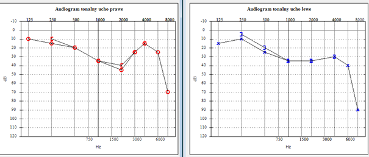

# Audiogram Reader

This project automatically detects and extracts hearing threshold values from audiogram images, classifies the audiogram type, and exports the data to CSV format.





## Table of Contents

- [Installation](#installation)
- [Usage](#usage)
- [Features](#features)
- [Project Structure](#project-structure)
- [License](#license)

---

## Installation

1. Clone the repository:

```bash
git clone https://github.com/MarinaGalanina/audiogram-reader.git
cd audiogram-reader
```
2. (Recommended) Create a virtual environment:

```bash
python -m venv .venv
.\.venv\Scripts\activate
```
3. Install dependencies:

```bash
pip install -r requirements.txt
```

## Usage

Run the tool from the root directory:

```python
python main.py <path_to_audiogram_image> <output_csv_path>
```

Example:

```python
python main.py test_images/sample1.png results/output.csv
```
## Features

-  **Automatic classification of audiogram type:**
  - `type_1`: manually labeled, scanned audiograms (with Polish terms like *ucho lewe/prawe*)
  - `type_2`: clinical/computer-generated audiograms

- **Detection of hearing thresholds** from visual markers (red circles, blue crosses)

- **Manual point correction** using OpenCV GUI:
  - Left-click = Add point  
  - Right-click = Remove closest point  
  - ESC = Finish editing

- **CSV export** with frequency, dB HL, and ear side

- **Modular design** with centralized logging (`logger.py`)

---

## Project Structure


```text
audiogram-reader/
├── main.py                  # Entry point
├── requirements.txt         # Dependencies
├── logger.py                # Logger config
├── README.md                # This file
├── test_images/             # Sample input audiograms
└── audiogram/               # Core logic
    ├── __init__.py
    ├── audiogram_classify.py      # Type detection logic
    ├── audiogram_parser_1.py      # Parser for type_1
    ├── audiogram_parser_2.py      # Parser for type_2
    └── data_normalization.py      # Pixel → frequency/dB mapping
```

## License

This project is under the MIT License